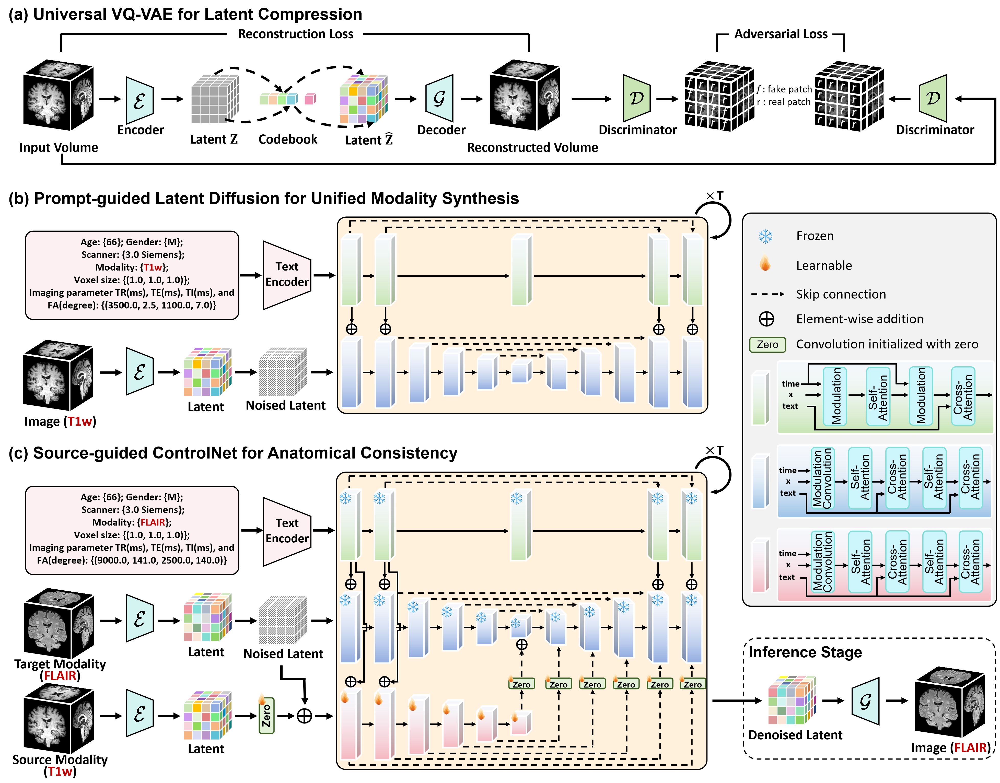

# BrainDiff: A Unified Latent Diffusion for High-Fidelity Any-to-Any Brain Modality Synthesis

BrainDiff has been accepted to the ***6th Deep Generative Models Workshop at MICCAI 2026 (DGM4MICCAI 2026)***.

This repository includes the inference code for **BrainDiff**.


### [Paper](https://dgm4miccai.github.io) | [Code](https://github.com/douyl/BrainDiff) | [Checkpoints](https://drive.google.com/drive/folders/1ZwjJA3MRFFwnjSLs3XpGzzh49ANPoQiX?usp=drive_link)

## Method Overview

BrainDiff generates 3D brain volumes in a shared 8x VAE latent space. It supports:

* VAE reconstruction for checking the latent representation.
* text-to-volume synthesis from acquisition descriptions.
* source-volume-guided text-to-volume synthesis with a source brain volume as structural guidance.



All scripts read and write NIfTI (`.nii.gz`) files. Results are saved under `Results/`.

## High-Level Structure

The code is organized as follows:

* `infer_autoencoder.py` runs VAE encoding and reconstruction.
* `infer_text2volume.py` generates a 3D volume from a text prompt.
* `infer_textvolume2volume.py` runs source-volume-guided text-to-volume synthesis.
* `configs/` contains inference configs for text-to-volume and source-volume-guided text-to-volume diffusion.
* `checkpoints/` stores model weights. See [`checkpoints/download_ckpt.txt`](checkpoints/download_ckpt.txt).
* `pretrained_models/bert-base-uncased/` stores the BERT text encoder. See [`pretrained_models/bert-base-uncased/download_bert.txt`](pretrained_models/bert-base-uncased/download_bert.txt).
* `TestCase/` contains example source volumes and text prompts.
* `Results/` is the default output directory.

## How to Use

### Get Started

We run with Python 3.10. Set up the environment with:

```bash
conda create -n braindiff python=3.10 -y
conda activate braindiff

pip install torch==2.3.0 torchvision==0.18.0 --index-url https://download.pytorch.org/whl/cu118
pip install -r requirements.txt
```

For CPU-only machines, install the CPU build of PyTorch from [pytorch.org](https://pytorch.org/get-started/locally/), then install `requirements.txt`.

### Download Model Weights

Download the model checkpoints according to [`checkpoints/download_ckpt.txt`](checkpoints/download_ckpt.txt) and place them as:

```text
checkpoints/
├── Autoencoder_8x.ckpt
├── Text2Volume_0090500.pt
└── TextVolume2Volume_0229000.pt
```

Download BERT from Hugging Face and place it under `pretrained_models/bert-base-uncased/`:

```bash
git lfs install
git clone https://huggingface.co/google-bert/bert-base-uncased pretrained_models/bert-base-uncased
```

### Prepare Data

Example prompts are provided in `TestCase/TargetText/`. Source volumes for Huashan examples are under `TestCase/Huashan/{T1w,T2w,FLAIR,CT,AV45-PET}/`.

Target text files should describe the desired modality and acquisition parameters, such as scanner, TR/TE/TI/FA for MRI, kVp/mAs for CT, or isotope/dose for PET.

### Usage

Run VAE reconstruction:

```bash
python infer_autoencoder.py TestCase/Huashan/T2w/AFM0002_Zhanghubian.nii.gz
```

Run text-to-volume generation:

```bash
python infer_text2volume.py TestCase/TargetText/OAS30001_to-FLAIR.txt
```

Run source-volume-guided text-to-volume synthesis:

```bash
python infer_textvolume2volume.py \
  TestCase/Huashan/T1w/AFM0002_Zhanghubian.nii.gz \
  TestCase/TargetText/AFM0002_to-AV45CT.txt
```

You will see outputs in `Results/AutoEncoder/`, `Results/Text2Volume/`, and `Results/TextVolume2Volume/`.

## Inference Details

Source volumes are clipped at the 99.9th percentile, min-max normalized to `[0, 1]`, and center-cropped or zero-padded to `(H, W, D) = (192, 256, 256)` before VAE encoding. Reconstructions are mapped back to the original field of view using the saved affine.

Diffusion models operate in VAE latent space with shape `(C, D, H, W) = (8, 32, 24, 32)`, corresponding to an effective output volume of `(256, 192, 256)` after 8x upsampling.

## Checkpoints and Configs

| Model | Checkpoint | Config |
| --- | --- | --- |
| VAE (8x) | `checkpoints/Autoencoder_8x.ckpt` | - |
| Text2Volume | `checkpoints/Text2Volume_0090500.pt` | `configs/Text2Volume.yaml` |
| Source-volume-guided Text2Volume | `checkpoints/TextVolume2Volume_0229000.pt` | `configs/TextVolume2Volume.yaml` |
| BERT text encoder | `pretrained_models/bert-base-uncased/` | - |

`infer_textvolume2volume.py` additionally loads the Text2Volume base weights from `checkpoints/Text2Volume_0090500.pt` through `--basemodel_load_from`.

Common options:

```text
--device auto|cuda|cuda:0|cpu
--config PATH
--checkpoint_path PATH
--results_dir PATH
```

`infer_text2volume.py` additionally accepts `--seeds INT [INT ...]`. `infer_autoencoder.py` and `infer_textvolume2volume.py` accept `--target_shape H W D`.

## Citation

If our code or models help your work, please cite our paper:

```bibtex
@inproceedings{dou2026unified,
  title={A Unified Latent Diffusion for High-Fidelity Any-to-Any Brain Modality Synthesis},
  author={Dou, Yulong and Chen, Guo and Xu, Chenfan and Wang, Yulin and Xu, Zhe and Cui, Zhiming and Shen, Dinggang},
  booktitle={MICCAI Workshop on Deep Generative Models},
  year={2026},
  organization={Springer}
}
```
